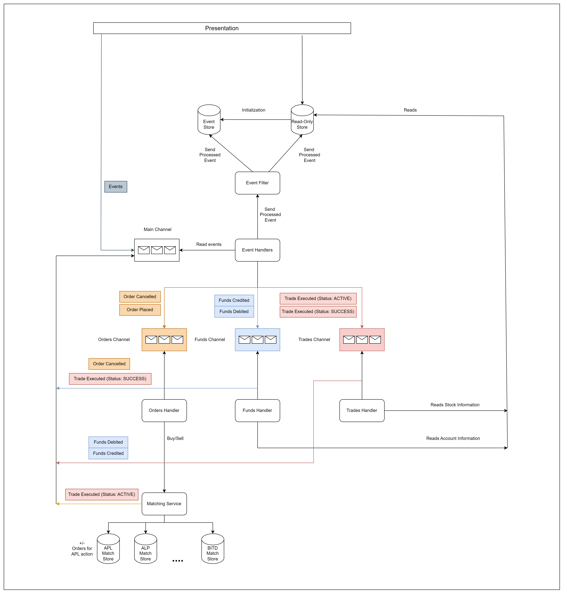

# System Design

## Context

This project simulates a small-scale stock trading application where users can buy and sell stocks.

It is based on **event sourcing**, meaning all system states (orders, trades, balances) are rebuilt by replaying a sequence of immutable events.

Originally developed as a **Software Design 2025 assignment**, it demonstrates real-world use of event sourcing for auditability and historical accuracy.

## Architecture

- **Event Sourcing:**
    - All system changes are captured as events (e.g., OrderPlaced, OrderCancelled, TradeExecuted).
    - State is reconstructed by replaying the full event history.

- **Event Store:**
    - Events are persisted in a log file.
    - The store supports appending and retrieving all events.

- **Domain Model:**
    - Includes `OrderBook`, `Account`, and `MaterializedView`.
    - Models react to events to update their internal state.

- **Commands:**
    - Commands trigger events (e.g., place order, cancel order, credit funds).
    - Commands do not directly mutate state.

- **Replayability:**
    - Full system state can be rebuilt anytime from the event log.

## System Design Diagram

